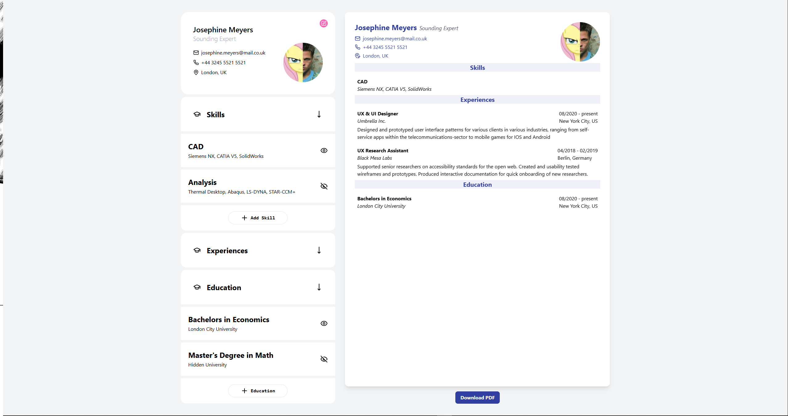

# [Live Demo](https://unflowcv.vercel.app/)



# CV Maker (React)

CV Maker is a modern, interactive web application for building and previewing professional CVs/resumes. Built with React and Vite, it provides a live preview, easy editing, and export options for your CV.

## Features

- **Live Preview**: Instantly see your CV as you edit personal details, skills, experiences, and education.
- **Section Editing**: Add, edit, and remove skills, experiences, and education entries with intuitive forms.
- **Visibility Controls**: Show or hide individual skills, experiences, or education items in the preview.
- **Profile Image Upload**: Upload and preview your profile photo.
- **Responsive Design**: Optimized for both desktop and mobile devices.
- **Download as PDF**: Export your CV as a pixel-perfect PDF using html2canvas-pro and jsPDF.
- **Modal Preview**: View your CV in a modal with a dedicated download button.
- **Consistent Styling**: Uses Tailwind CSS for a clean, modern look.

## Technologies Used

-  **React** (UI library)
-  **Vite** (build tool)
-  **Tailwind CSS** (utility-first CSS framework)
-  **Lucide React** (icon library)
- **html2canvas-pro** (DOM to image for PDF export)
- **jsPDF** (PDF generation)

## Getting Started

1. Install dependencies:
   ```bash
   npm install
   ```
2. Start the development server:
   ```bash
   npm run dev
   ```
3. Open [http://localhost:5173](http://localhost:5173) in your browser.

## Project Structure

- `src/components/` - All React components (forms, preview, modal, etc.)
- `src/exampleData.jsx` - Example data for initial state
- `src/App.jsx` - Main application logic

## License

This project is for educational and personal portfolio use.
